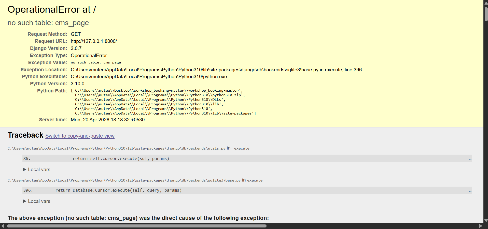
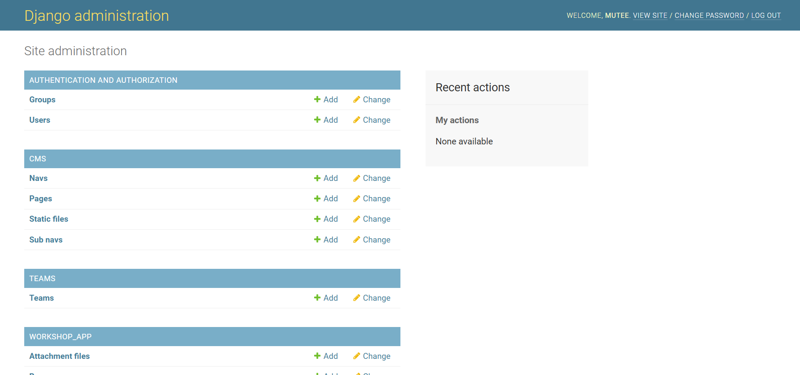
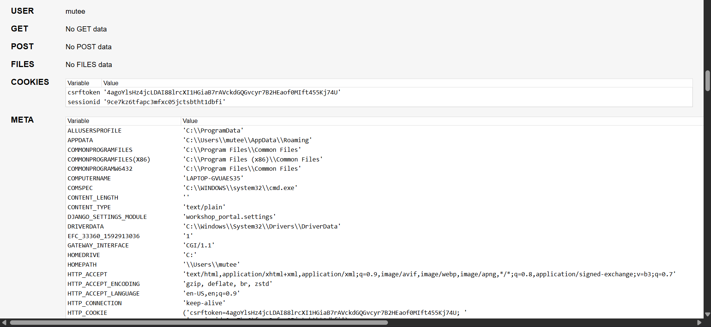

# Workshop Booking UI/UX Enhancement (React)

## 1. Overview
This project focuses on improving the UI/UX of the workshop booking platform provided in the assignment.

The original repository is built using Django and primarily focuses on backend functionality. The goal was to enhance usability, responsiveness, and overall user experience using React.

---

## 2. Initial Analysis of the Repository

I cloned and attempted to run the provided Django project to understand its structure and functionality.

During this process, several issues were identified which affected usability.

---

## 3. Problems Identified

### 3.1 Dependency Conflicts
- Conflicts between different Django versions (2.x, 3.x, 5.x)
- CMS-related packages required incompatible versions

### 3.2 Runtime Errors
- Errors like `no such table: cms_page`
- Missing or non-functional frontend rendering

### 3.3 Version Compatibility Issues
- Deprecated imports such as `django.conf.urls.url`
- Not compatible with modern Django versions

---

## 4. Key Insight

The system was:
- Backend-heavy
- Not easily runnable in a modern environment
- Lacking a usable and user-friendly frontend

---

## 5. Design Approach

Instead of focusing only on fixing backend issues, I redesigned the frontend using React to improve usability and accessibility.

The aim was to create a clean, intuitive, and mobile-friendly interface while preserving the core workflow.

---

## 6. Design Principles Used

1. Simplicity – Minimal and clean layout  
2. Visual Hierarchy – Important elements stand out clearly  
3. Consistency – Uniform spacing, colors, and structure  
4. Accessibility – Easy-to-read text and touch-friendly UI  
5. User Flow Optimization – Logical navigation across pages  

---

## 7. Responsiveness Strategy

1. Mobile-first design approach  
2. Flexible layouts and spacing  
3. Large, accessible buttons  
4. Centered content for readability  

---

## 8. Features Implemented

1. Home page with clear navigation  
2. Workshop listing page with structured layout  
3. Booking form with validation and feedback  
4. Smooth navigation using React Router  

---

## 9. User Flow

Home → Workshops → Booking

---

## 10. Trade-offs

Due to backend dependency conflicts, mock data was used instead of integrating with the Django backend.

This allowed focusing on UI/UX improvements without being blocked by environment issues.

---

## 11. Most Challenging Part

The biggest challenge was handling dependency conflicts and version mismatches in Django and CMS packages.

After multiple attempts to resolve them, it became clear that the system required significant environment restructuring.

This was addressed by shifting focus toward frontend redesign.

---

## 12. Before vs After Comparison

This comparison highlights the transformation from a non-functional backend-heavy system to a clean, user-friendly interface.

### 🔴 Before (Original System)

#### 12.1 Error / Broken UI

#### 12.2 Admin Interface

#### 12.3 Partial Page

---

### 🟢 After (React UI Redesign)

#### 12.4 Home Page

#### 12.5 Workshops Page

#### 12.6 Booking Page

13. Setup Instructions  
Run the project:

npm install  
npm start  

---

## 14. Conclusion

This project demonstrates how improving UI/UX can transform a backend-focused system into a user-friendly application.

The focus was on clarity, usability, responsiveness, and smooth interaction.